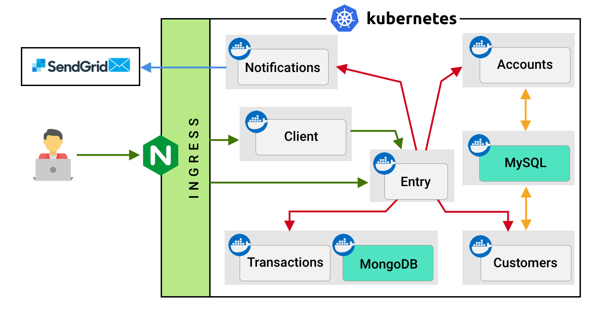

# PayDay Bank

## Description

## Deployment
We will use kubernetes for a Microservices Orchestration.
Ready to deploy docker images are build and pushed to hub. 
Anyway, if you want to run services separately and test them, you can read README files inside each service directory.

app | service-name | port | image | description
--- | --- | --- | --- | ---
payday | customers-service     | 9000       | malikaliyev94/customers-service     | spring boot REST
payday | accounts-service      | 9001       | malikaliyev94/accounts-service      | spring boot REST
payday | transactions-service  | 9002       | malikaliyev94/transactions-service  | spring-boot REST
payday | notifications-service | 9003       | malikaliyev94/notifications-service | flask REST
payday | entry-service         | 4000       | malikaliyev94/entry-service         | apollo GraphQL
payday | client-service        | 3000       | malikaliyev94/client-service        | create-reapp-app
payday | mysql-database        | 3306       | mysql:5.7                           | 
payday | mongodb               | 27017      | mongo                               | 
payday | gateway-ingress       | 4000, 3000 |                                     | 

The final architecture is as in the following pic.



To run all services we need need at least a single node cluster instance of Kubernetes. We can use ```minikube``` on local machine.
First install and start minikube.
```
minikube start
```

Launch minikube dashboard with command
```
minikube dashboard
```

```kubernetes``` folder consist of deployment, service and ingress configuration files to run deploy and run services in kubernetes cluster.

One service can refer to other service by it's name. For exaple entity service can access customer service by ```htttp://customers-service:9000``` address.

Below you can see how to apply deployment and service configurations with kubernetes (minikube);

First cd to kubernetes folder

```
cd ./kubernetes
```

- Apply mysql
```
kubectl apply -f mysql.yaml
```

You should get logs like below
```
ervice/mysql-database created
deployment.apps/mysql-database created
```

Now we should create databases for customers (dbname = payday_customer) and accounts (dbname = payday_accounts) services.
To connect to mysql shell run the command
```
kubectl run -it --rm --image=mysql:5.7 --restart=Never mysql-client -- mysql -h mysql-database -ppassword
```
After create databases
```
CREATE DATABASE IF NOT EXISTS payday_customers;

CREATE DATABASE IF NOT EXISTS payday_accounts;
```
Check tables
```
show databases;
```

- Apply customers-deployment and customers-service configurations
```
kubectl apply -f customers-deployment.yaml

kubectl apply -f customers-service.yaml
```
- Apply accounts-deployment and accounts-service configurations
```
kubectl apply -f accounts-deployment.yaml

kubectl apply -f accounts-service.yaml
```
- Apply transactions-deployment and transactions-service configurations
```
kubectl apply -f transactions-deployment.yaml

kubectl apply -f transactions-service.yaml
```
Mongodb is also will be configured and deployed with transactions-service

- Apply notifications-deployment and notifications-service configurations
```
kubectl apply -f notifications-deployment.yaml

kubectl apply -f notifications-service.yaml
```

- Apply entry-deployment and entry-service configurations
```
kubectl apply -f entry-deployment.yaml

kubectl apply -f entry-service.yaml
```
This GraphQL service is an integration service of all other services.
Also this service used as an authorization service (Token based authorization JWT)

We can access entry-service by configuring NodePort of entry-service. But in this example we will use ingress.
To use ingress with minikube we need to enable addon.
```
minikube addons enable ingress
```
Then apply ingress configuration
```
kubectl apply -f ingress.yaml
```
Now you should edit your hosts file in order to access entry service.
Add ``` {MINIKUBE_IP} payday.local``` line to your hosts file. For example:
```
192.168.64.2 payday.local
```
To get MINIKUBE_IP run 
```
minikube ip
```

We will not deploy client-app to the kubernetes. To run and test app go to ```./client-app``` directoru and run:
 ```
npm install

npm run start
```
Also do not forget in the ./client-app/src/App.js file set the GraphQL server url (line 11) to http://MINIKUBE_IP:4000

## Why GraphQL
Because at the end you can get all information you need with a such beautiful query :D
```
query {
  customer {
    id 
    name 
    last_name
    phone
    gender
    date_of_birth
    email 
    debitAccounts {
      id 
      accn
      name
      transactions {
        id
        description
        date_of_transaction
        amount
      }
    }
    creditAccounts {
      id
      accn
      name
      transactions {
        id
        description
        date_of_transaction
        amount
      }
    }
  }
}
```

## GraphQL Queries


## Notifications
- Use real email addresses while signing up. You will receive emails from no-reply@payday.local
- SendGrid 3-rd party service have been used to send email notifications.

## Interesting
- I have never use spring and kubernetes before
- I have spent 2 days for composing README files and 3 hours for the client-app development :D
- I tried to use a component based approach. For example in GraphQL server all modules are components that contain schema definitions, models, resolvers etc. Also with spring boot Controllers, Repositories and etc. are structured based on components.

## What can be improved
- Implementing CI/CD solutions (GitHub hooks, Jenkins etc.)
- More advanced JWT implementation (with refresh token, expiration etc.)
- More advanced validating 
- In this project I have connected accounts and customers services to the same database for simplicity. It would be better to separate them also. 
